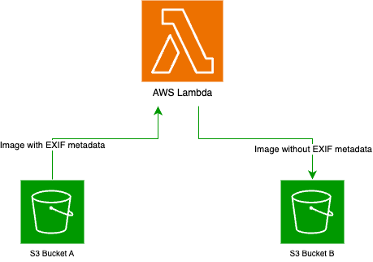

# 🧬 Genomics England — AWS/Terraform/Python Test

GEL – Platform Engineer – AWS/Terraform/Python Test 2021

Please complete this exercise within 2 days of receipt of this task. To share your
solution, send us a link to a repository on the platform of your choice (GitHub, or
GitLab, or Bitbucket, or something else). Please do not feel that you have to spend
the whole time on the exercise, we have allowed a longer time to allow you to think on
the method. There is no right or wrong answer to this, we are interested in seeing
your approach to the task.
Step 1
A company allows their users to upload pictures to an S3 bucket. These pictures are always in the .jpg format.
The company wants these files to be stripped from any exif metadata before being shown on their website.
Pictures are uploaded to an S3 bucket A.
Create a system that retrieves .jpg files when they are uploaded to the S3 bucket A, removes any exif metadata,
and save them to another S3 bucket B. The path of the files should be the same in buckets A and B.

Step 2
To extend this further, we have two users User A and User B. Create IAM users with the following access:

• User A can Read/Write to Bucket A

• User B can Read from Bucket B

--
  

## 📸 Overview

For this solution, I chose to implement an AWS Lambda function, assuming the relatively small payload size of the images I thought this service would provide the functionality needed. While the EXIF specification does not strictly define a maximum metadata size, in practice, EXIF metadata is limited to approximately 64 KB, with typical .jpg or .jpeg images containing 1 KB to 50 KB of metadata.

This solution uses a serverless, AWS-based architecture to automatically strip EXIF metadata from image files uploaded to an Amazon S3 bucket. Upon upload, a Lambda function is triggered to process the image, remove any EXIF metadata, and store the sanitized version in a separate destination bucket — preserving the file path.

When a user uploads a file to **S3 Bucket A**, an **AWS Lambda function** is triggered to:

1. Retrieve the image.
2. Remove any embedded EXIF metadata.
3. Save a sanitized version to **S3 Bucket B**, maintaining the same object key (file path).

---

## 🎯 Objectives

- ✅ Automatically remove sensitive EXIF metadata (location, timestamps, camera details, etc.).
- ✅ Separate source (raw) and destination (clean) storage buckets.
- ✅ Enable controlled access through IAM for different user roles.
- ✅ Implement everything as Infrastructure-as-Code using Terraform.

---

## ⚙️ How It Works

1. **Image Upload**  
   A user uploads a `.jpg` or `.jpeg` image to **S3 Bucket A**.

2. **Lambda Trigger**  
   S3 triggers the **Lambda function** on object creation events (`s3:ObjectCreated:*`).

3. **EXIF Metadata Removal**  
   The Lambda function:
   - Downloads the image from Bucket A.
   - Uses the "exif" Python module to check and remove all EXIF metadata.
   - Uploads the cleaned image to Bucket B, preserving the original object path.

4. **Result**  
   The cleaned image is now available in Bucket B for the web develop to load to company's website.

---

## 🔐 IAM & Access Control

To follow the principle of **least privilege**, the solution defines two IAM users:

| User     | Permissions                            |
|----------|----------------------------------------|
| User A   | Read/Write access to **Bucket A**      |
| User B   | Read-only access to **Bucket B**       |

**Lambda Role Permissions**:
- Read from **Bucket A**
- Write to **Bucket B**
- Log to **CloudWatch**

---

## 🧰 Tech Stack

| Technology      | Purpose                                 |
|----------------|------------------------------------------|
| AWS S3          | Object storage for raw & clean images   |
| AWS Lambda      | EXIF-stripping compute function         |
| AWS IAM         | Secure access control                   |
| AWS CloudWatch  | Function monitoring/logging             |
| Terraform       | Infrastructure-as-Code (IaC)            |
| Python 3.13     | Lambda runtime                          |
| `exif` module   | Python library for metadata operations  |

---

## 🚀 Deployment Notes

- Built using Terraform for repeatable deployments.
- Supports `.jpg` and `.jpeg` file extensions (case-insensitive).

---

## 🗂️ Project Structure

├── main.tf                      # Terraform configuration

├── provider.tf 		            # AWS provider module

├── lambda_function.py           # Python logic for EXIF cleaning

├── lambda_exif_cleaner.zip      # Lambda deployment package

├── README.md                    # Project documentation
